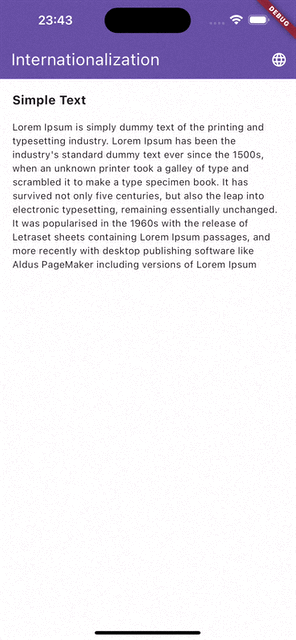
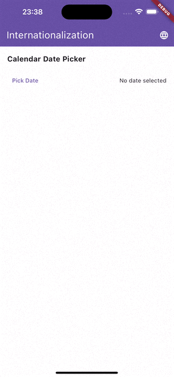
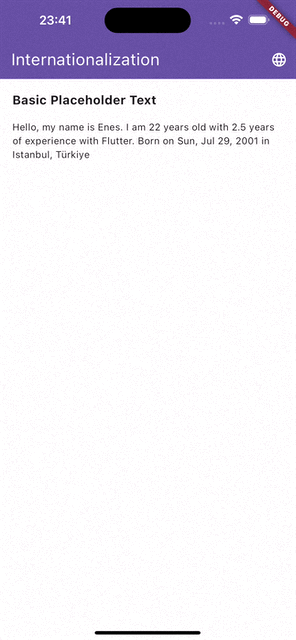
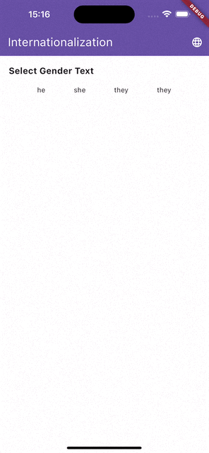
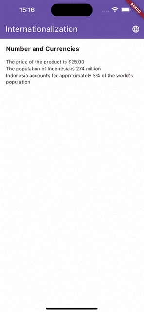

# Flutter Localization 
In this project, I tried to explain in detail how to do Localizations in Flutter.


## Folder Structure
```
lib
├── l10n
│   ├── arb
│   │   ├── app_de.arb
│   │   ├── app_en.arb
│   │   └── app_tr.arb
│   │ 
│   ├── l10n.dart
│   └── locale_provider.dart
│ 
├── views
│   └── home_view.dart
│ 
├── widgets
│   ├── _custom_text_widget.dart
│   ├── basic_placeholder_text_widget.dart
│   ├── calendar_date_picker_widget.dart
│   ├── numbers_and_currencies_widget.dart
│   ├── plural_text_widget.dart
│   ├── select_text_widget.dart
│   └── simple_text_widget.dart
│ 
└── main.dart
```


## Dependencies
```yaml
dependencies:
  flutter:
    sdk: flutter
  flutter_localizations: # for localization
    sdk: flutter
  intl: ^0.18.0 # for localization
  provider: ^6.1.1 # for change locale

dev_dependencies:
  flutter_test:
    sdk: flutter
  flutter_lints: ^2.0.0

flutter:
  uses-material-design: true
  generate: true # for generating l10n files
```

## l10n.yaml

``` yaml
#* This YAML file contains configuration settings for localization in the application.

#* - `arb-dir`: Specifies the directory where the ARB (Application Resource Bundle) files are located.
#* - `template-arb-file`: Specifies the name of the template ARB file.
#* - `output-localization-file`: Specifies the name of the output file that will contain the generated localizations.
#* - `nullable-getter`: Specifies whether the generated getter methods should be nullable or not.
#* - `untranslated-messages-file`: Specifies the name of the file that will contain the untranslated messages.

arb-dir: lib/l10n/arb
template-arb-file: app_de.arb
output-localization-file: app_localizations.dart
nullable-getter: false
untranslated-messages-file: untranslated_messages.json
```

## Extension on BuildContext for easily usage

```dart
import 'package:flutter/material.dart';
import 'package:flutter_gen/gen_l10n/app_localizations.dart';

export 'package:flutter_gen/gen_l10n/app_localizations.dart';

extension AppLocalizationsX on BuildContext {
  AppLocalizations get l10n => AppLocalizations.of(this);
}
```

---


## Simple Text


### Configuration

``` arb
"simpleTextTitle": "Simple Text",
"simpleTextContent": "Lorem Ipsum is simply dummy text of the printing and typesetting industry. Lorem Ipsum has been the industry's standard dummy text ever since the 1500s, when an unknown printer took a galley of type and scrambled it to make a type specimen book. It has survived not only five centuries, but also the leap into electronic typesetting, remaining essentially unchanged. It was popularised in the 1960s with the release of Letraset sheets containing Lorem Ipsum passages, and more recently with desktop publishing software like Aldus PageMaker including versions of Lorem Ipsum"
```

### Usage
```dart
class SimpleTextWidget extends StatelessWidget {
  const SimpleTextWidget({super.key});

  @override
  Widget build(BuildContext context) {
    final l10n = context.l10n;

    return CustomText(
      title: l10n.simpleTextTitle,
      content: Text(l10n.simpleTextContent),
    );
  }
}
```

---

## Calendar Date Picker



### Configuration

``` arb
"calendarDatePickerTitle": "Calendar Date Picker",
"calendarDatePickerButton": "Pick Date",
"calendarDatePickerNoSelected": "No date selected",
```

### Usage
```dart
class CalendarDatePickerWidget extends StatefulWidget {
  const CalendarDatePickerWidget({super.key});

  @override
  State<CalendarDatePickerWidget> createState() => _CalendarDatePickerWidgetState();
}

class _CalendarDatePickerWidgetState extends State<CalendarDatePickerWidget> {
  //* A value notifier to listen to the selected date
  late final ValueNotifier<DateTime?> selectedDate;

  @override
  void initState() {
    selectedDate = ValueNotifier<DateTime?>(null);
    super.initState();
  }

  @override
  void dispose() {
    selectedDate.dispose();
    super.dispose();
  }

  @override
  Widget build(BuildContext context) {
    final l10n = context.l10n;

    return CustomText(
      title: l10n.calendarDatePickerTitle,
      content: Row(
        children: [
          //* CalendarDatePicker
          TextButton(
            onPressed: () async {
              selectedDate.value = await showDatePicker(
                    context: context,
                    currentDate: DateTime.now(),
                    firstDate: DateTime(1900),
                    lastDate: DateTime(2100),
                    initialDatePickerMode: DatePickerMode.day,
                  ) ??
                  DateTime.now();
            },
            child: Text(l10n.calendarDatePickerButton),
          ),
          const Spacer(),

          //* Selected Date
          ValueListenableBuilder<DateTime?>(
            valueListenable: selectedDate,
            builder: (_, selectedDate, __) {
              return Builder(
                builder: (context) {
                  if (selectedDate != null) {
                    final locale = Localizations.localeOf(context);

                    return Text(
                      DateFormat.yMMMEd(locale.languageCode).format(selectedDate),
                      style: const TextStyle(fontSize: 14),
                    );
                  }

                  return Text(
                    l10n.calendarDatePickerNoSelected,
                    style: const TextStyle(fontSize: 14),
                  );
                },
              );
            },
          ),
        ],
      ),
    );
  }
}

```
---
## Basic Placeholder Text


### Configuration

``` arb
    "basicPlaceholderTitle": "Basic Placeholder Text",
    "basicPlaceholderContent": "Hello, my name is {name}. I am {age} years old with {experience} years of experience with Flutter. Born on {birthDate} in {birthPlace}",
    "@basicPlaceholderContent": {
        "description": "A message with name, age, experience, birthDate and birthPlace parameters",
        "placeholders": {
            "name": {
                "type": "String",
                "example": "Enes"
            },
            "age": {
                "type": "int",
                "example": "23"
            },
            "experience": {
                "type": "double",
                "example": "2.5"
            },
            "birthDate": {
                "type": "DateTime",
                "format": "yMMMEd"
            },
            "birthPlace": {
                "type": "String",
                "example": "Istanbul, Türkiye"
            }
        }
    }
```

### Usage
```dart
class BasicPlaceholderTextWidget extends StatelessWidget {
  const BasicPlaceholderTextWidget({super.key});

  @override
  Widget build(BuildContext context) {
    final l10n = context.l10n;

    //* Text with parameters
    return CustomText(
      title: l10n.basicPlaceholderTitle,
      content: Text(
        l10n.basicPlaceholderContent(
          'Enes',
          22,
          2.5,
          DateTime(2001, 07, 29),
          'Istanbul, Türkiye',
        ),
      ),
    );
  }
}

```

---
## Prural Text


### Configuration

``` arb
    "nKangaroosTitle": "Plural Text",
    "nKangaroosContent": "{count, plural, =0{no kangaroos} =1{1 kangaroo} other{{count} kangaroos}}",
    "@nKangaroosContent": {
        "description": "A plural message for kangaroos",
        "placeholders": {
            "count": {
                "type": "num",
                "format": "compact"
            }
        }
    }
```

### Usage
```dart
class TextWithPluralWidget extends StatelessWidget {
  const TextWithPluralWidget({super.key});

  @override
  Widget build(BuildContext context) {
    final l10n = context.l10n;

    //* Text with plural
    return CustomText(
      title: l10n.nKangaroosTitle,
      content: Row(
        mainAxisAlignment: MainAxisAlignment.spaceEvenly,
        children: [
          Text(l10n.nKangaroosContent(0)), //* Returns '0 kangaroos'
          Text(l10n.nKangaroosContent(1)), //* Returns '1 kangaroo'
          Text(l10n.nKangaroosContent(12)), //* Returns '12 kangaroos'
        ],
      ),
    );
  }
}
```

---
## Select Text


### Configuration

``` arb
    "pronounTitle": "Select Gender Text",
    "pronounContent": "{gender, select, male{he} female{she} other{they}}",
    "@pronounContent": {
        "description": "A gendered message",
        "placeholders": {
            "gender": {
                "type": "String"
            }
        }
    }
```

### Usage
```dart
class TextWithSelectWidget extends StatelessWidget {
  const TextWithSelectWidget({super.key});

  @override
  Widget build(BuildContext context) {
    final l10n = context.l10n;

    //* Text with Select
    return CustomText(
      title: l10n.pronounTitle,
      content: Row(
        mainAxisAlignment: MainAxisAlignment.spaceEvenly,
        children: [
          Text(l10n.pronounContent('male')), //* Returns 'he'
          Text(l10n.pronounContent('female')), //* Returns 'she'
          Text(l10n.pronounContent('other')), //* Returns 'they'
          Text(l10n.pronounContent('wrong key')), //* Returns 'they'
        ],
      ),
    );
  }
}
```

---
## Number And Currencies Text


### Configuration

``` arb
    "numberAndCurrenciesTitle": "Number and Currencies",

    "simpleCurrencyContent": "The price of the product is {currency1}",
    "@simpleCurrencyContent": {
        "description": "A message with a formatted int|double parameter",
        "placeholders": {
            "currency1": {
                "type": "double",
                "format": "simpleCurrency",
                "optionalParameters": {
                    "decimalDigits": 2
                }
            }
        }
    },

    "compactLongContent": "The population of {country} is {compactLong}",
    "@compactLongContent": {
        "description": "A message with a formatted double parameter",
        "placeholders": {
            "compactLong": {
                "type": "double",
                "format": "compactLong"
            },
            "country": {
                "type": "String",
                "example": "Turkey"
            }
        }
    },

    "percentContent": "{country} accounts for approximately {percent} of the world's population",
    "@percentContent": {
        "description": "A message with a formatted double parameter",
        "placeholders": {
            "percent": {
                "type": "double",
                "format": "decimalPercentPattern"
            },
            "country": {
                "type": "String",
                "example": "Turkey"
            }
        }
    }
```

### Usage
```dart
class NumberAndCurrenciesWidget extends StatelessWidget {
  const NumberAndCurrenciesWidget({super.key});

  @override
  Widget build(BuildContext context) {
    final l10n = context.l10n;

    return CustomText(
      title: l10n.numberAndCurrenciesTitle,
      content: Column(
        crossAxisAlignment: CrossAxisAlignment.start,
        children: [
          Text(l10n.simpleCurrencyContent(25)),
          Text(l10n.compactLongContent(274000000, 'Indonesia')),
          Text(l10n.percentContent(0.03, 'Indonesia')),
        ],
      ),
    );
  }
}

```

---